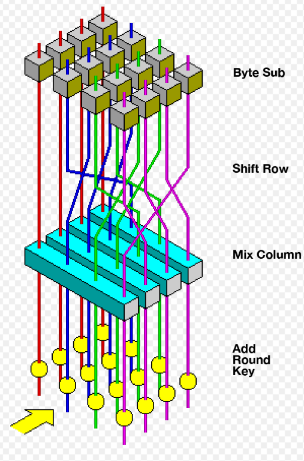
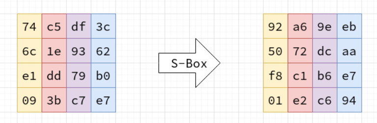
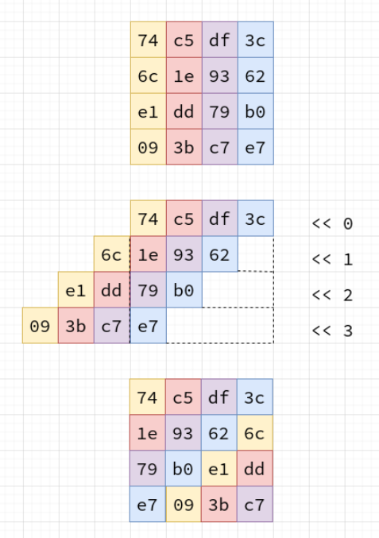

# This document is required.

What is AES?

The Advanced Encryption Standard (AES), or Rijndael was developed by two Belgian cryptographers, Joan Daemen and Vincent Rijmen. 

History of AES\
Before AES:\
There used to be a standard called the Data Encryption Standard (DES), implemented in 1977.\
However, by the late 1990s, it was starting to become outdated and people were able to brute force attack DES and crack it.\
So, in 1998, the U.S. National Institute of Standards and Technology (NIST) started a competition to find a replacement.\
After 15 candidates and 5 finalist, in 2001, the Rijndael algorithm won the competition and became AES.\
The Rijndael algorithm is a desendant of the Square algorithm, also created by Joan Daemen and Vincent Rijmen.\
On May 26, 2002, AES became a U.S. federal government standard

One of the reasons why Rijndael was eventually chosen as AES is because of its low hardware requirements.\
AES performs well on many different types of hardware, from 8-bit smart cards to high-performance computers.

There are 3 different versions of AES encryption, each has a block size of 128 bits, but with different key lengths: 128, 192 and 256 bits.\
In this presentation, we will be working with 128 bits.

How does AES work?

AES is a extremely widely used symmetric block cipher.\
Symmetric here means that we can use the same key to both encrypt and decrypt the plaintext.\
A block refers to the plaintext.\
We have to convert the plaintext into blocks.\
Each block is made up of 16 bytes (128 bits), and is arranged in column-major order.\
Since a single block is 16 bytes, a 4x4 matrix holds the data in a single block, with each cell holding a single byte of information.\
AES transforms each 16-byte block of data by a combination of moving the bytes around, performing reversible mathematical operations on them, and swapping them out for other bytes in a lookup table.\
The idea with AES is that this block is scrambled and mutated in a way that is completely reversible, driven by the secret key.

There are many different modes of operation for AES encryption\
One of the modes is ECB: Electronic Code Book\
This mode is the most simplist method of the algorithm\
First compute all of the round keys\
then iterate through the plaintext data in chunks of 128-bits, turning that data into a block\
then run it through the algorithm.\
The ciphertext output is placed into an output buffer or file, and the next 128-bits is loaded and processed.\
One potental problem with this mode is that even if the data itself is secure\
leaking structural information like this can be still be devastating\
This is the mode that is used in this code

Another mode is CBC: Cipher Block Chaining\
In AES-CBC, the problem is addressed by forcing interdependence between all of the blocks in the plaintext data.\
When encrypting, a random initial value is chosen.\
The initial value is a random 16-byte block, which is added to the first plaintext block before it is encrypted.\
The output is the first ciphertext block.\
The next plaintext block is then added to ciphertext block before being encrypted\
This forces a reversible chain between the ciphertext block and the plaintext blocks

The first step of the algorithm is the Key schedule step\
This step expands the secret key, creating more keys which will be used later.

The second step is the actions step\
There are 4 different actions:\
Substitute Bytes\
Shift Rows\
Mix Columns\
Adding the Round Key\
each of these round keys will happen 10 times, except for Mix Column, which will not happen in the final round.

This presentation will cover the first 2 of 4 actions of AES encryption, SubBytes and ShiftRows. 

The SubBytes action goes first.\
It takes in a 4 by 4
It uses a lookup table like the vigenere cipher.\
\
As we can see, it is a 16 by 16 table, with a possible 256 combonations in total.\
A byte represented in hexadecimal format is made of 2 characters from 0-f\
So, for example, lets say there is a byte represented by 53 in hexadecimal format.\
In order to encrypt that in SubBytes, you would take the first Nibble (4 bits, or half a byte), and that would be the 'y' value, or row, in the S-box.\
Then, you would take the secoond Nibble, and that would be the 'x' value, or column, in the S-box.\
So, using this formula, lets say you have to encrypt the number 53, that would convert into ed.\
You would do this for every byte.\

The next action is the ShiftRows action.\
It takes a 4 by 4 row, and shifts each row to the left by a certain amount:\
the first row shifts by nothing\
the second row shifts to the left by 1\
the third row shifts to the left by 2\
the fourth row shifts to the left by 3\
This will cause diffusion, causing the encrypted message to be harder to ananlyze if found by hackers or other bad actors.\

