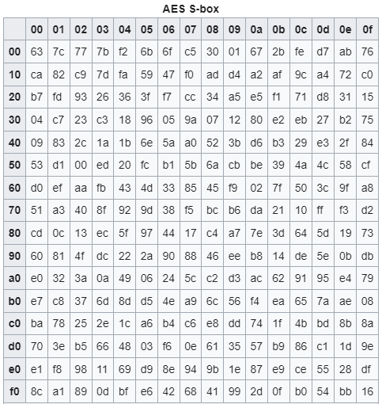

# This document is required.

What is AES?

The Advanced Encryption Standard (AES), or Rijndael was developed by two Belgian cryptographers, Joan Daemen and Vincent Rijmen. 

History of AES\
Before AES:\
There used to be a standard called the Data Encryption Standard (DES), implemented in 1977.\
However, by the late 1990s, it was starting to become outdated and people were able to brute force attack DES and crack it.

So, the U.S. National Institute of Standards and Technology (NIST) started a competition to find a replacement.\
After 15 candidates and 5 finalist, the Rijndael algorithm won the competition and became AES.

There are 3 different versions of AES encryption, each has a block size of 128 bits, but with different key lengths: 128, 192 and 256 bits.

How does AES work?

AES is a extremely widely used symmetric block cipher.\
Symmetric here means that we can use the same key to both encrypt and decrypt the plaintext.\
A block refers to the plaintext.\
We have to convert the plaintext into blocks.\
Each block is made up of 16 bytes (128 bits), and is arranged in column-major order.\
The idea with AES is that this block is scrambled and mutated in a way that is completely reversible, driven by the secret key.\

This part of the presentation will cover the first 2 of 4 steps of AES encryption, SubBytes and ShiftRows. 

The SubBytes step goes first.\
It takes in a 4 by 4
It uses a lookup table like the vigenere cipher.\
\
As we can see, it is a 16 by 16 table, with a possible 256 combonations in total.\
A byte represented in hexadecimal format is made of 2 characters from 0-f\
So, for example, lets say there is a byte represented by 53 in hexadecimal format.\
In order to encrypt that in SubBytes, you would take the first Nibble (4 bits, or half a byte), and that would be the 'y' value, or row, in the S-box.\
Then, you would take the secoond Nibble, and that would be the 'x' value, or column, in the S-box.\
So, using this formula, lets say you have to encrypt the number 53, that would convert into ed.\
You would do this for every byte. \

The next step is the ShiftRows step.\
It takes a 4 by 4 row, and shifts each row to the left by a certain amount:\
the first row shifts by nothing\
the second row shifts to the left by 1\
the third row shifts to the left by 2\
the fourth row shifts to the left by 3\
This will cause diffusion, causing the encrypted message to be harder to ananlyze if found by hackers or other bad actors.s
